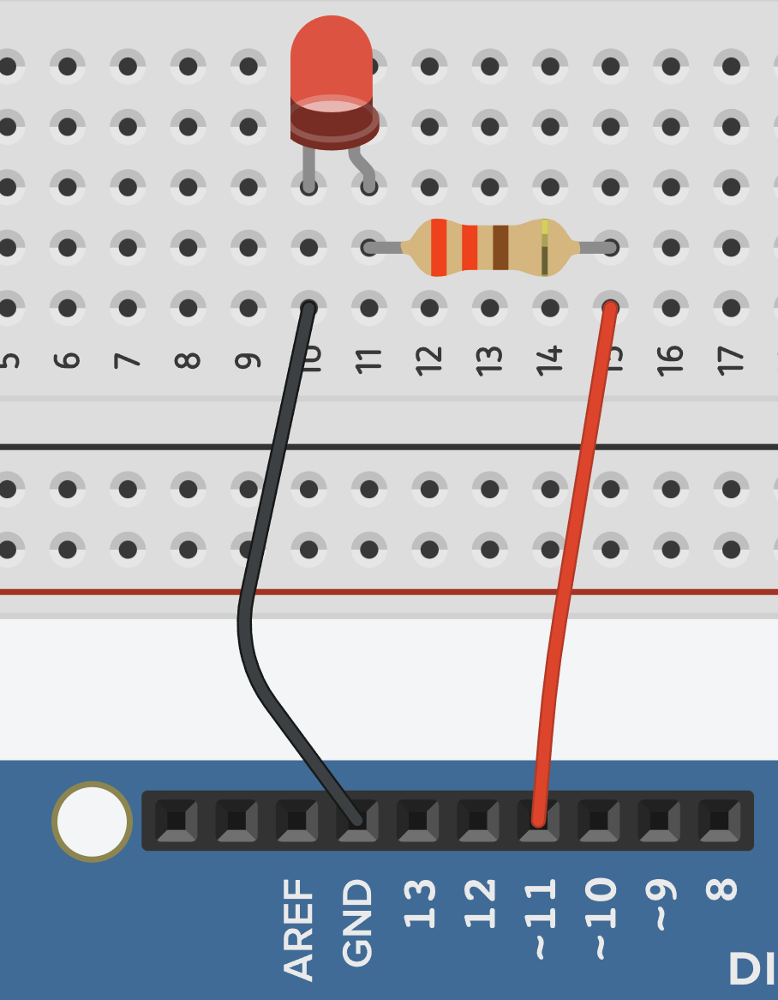
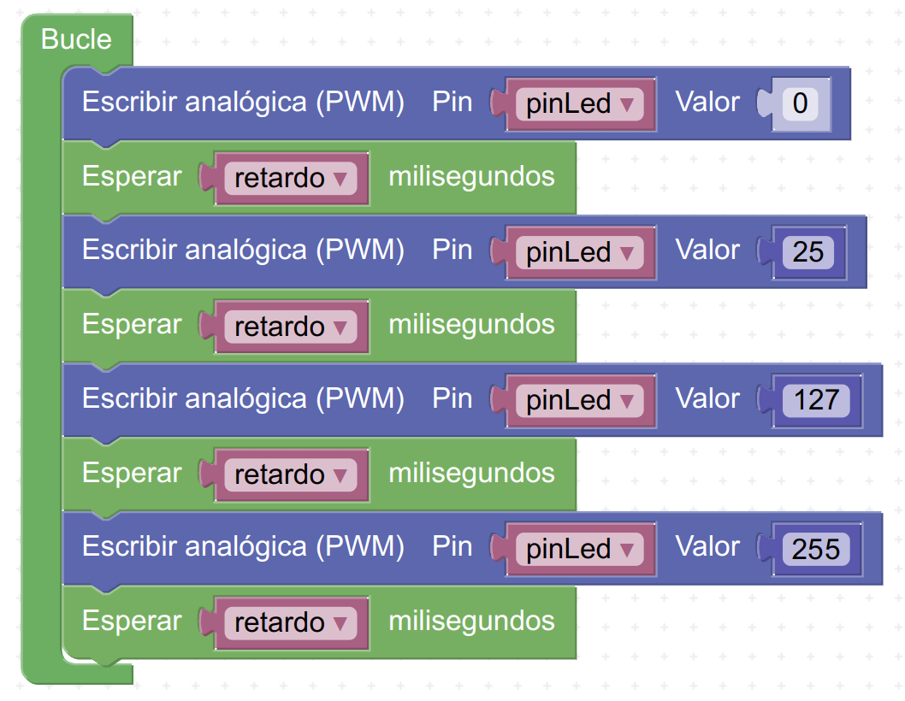
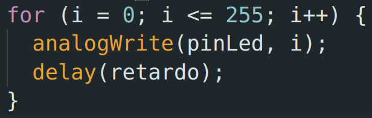
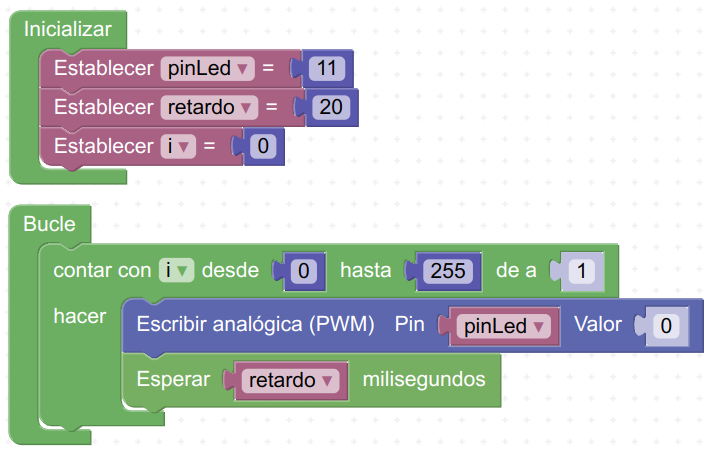
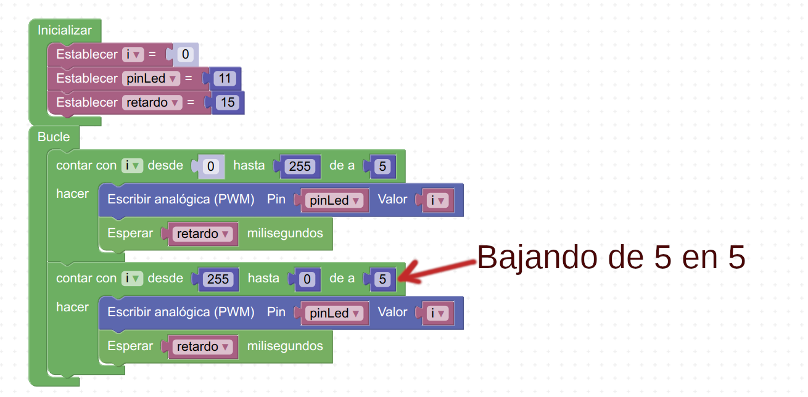

:date: 2026-06-21
:modified: 2026-06-24
:author: Francisco Trigueros
:license: Creative Commons Attribution-ShareAlike 4.0 International
:license_url: https://creativecommons.org/licenses/by-sa/4.0/

Salidas PWM
===========
|icono-video| VÍDEO: `PWM en Arduino para regular la intensidad de brillo de un LED
<https://www.youtube.com/watch?v=_EqMkNmlm1Q>`__

.. note::
   No todos los pines digitales se pueden usar con PWM,
   solamente los que se indican con una "onda":
   
   .. figure:: _images/arduino-ft-08.png
      :width: 480px
      :align: center
   

:index:`PWM` (Pulse Wide Modulation o Modulación de Ancho de Pulso)
   Es una técnica que se utiliza para simular valores de distinta
   intensidad analógicos mediante pulsos o "parpadeos" de la señal:
   
   .. figure:: _images/arduino-ft-09.png
      :width: 800px
      :align: center

Código para encender un LED conectado en el pin 9 con una intensidad de
25 (la intensidad puede ir desde 0 hasta 255):

.. code-block:: arduino
   :linenos:

   analogWrite(9, 25);

Tarea PWM brillo
----------------
Monta el circuito de la figura:

Realiza el mismo programa que el de las tareas anteriores,
pero en vez de repetir las líneas con las mismas
instrucciones cuatro veces, usa el bucle ``for( )``.

Prueba a ir cambiando el número de repeticiones y los tiempos de
encendido y apagado, verás cómo ahora es más rápido usando las
variables y el bucle ``for( )``.

Sería el código equivalente a:

Ajuste de brillo con bucle for
------------------------------

|icono-video| VÍDEO: `Ajuste de brillo usando la variable "i" del bucle for()
<https://www.youtube.com/watch?v=V_GoKMmdV4I>`__

Tarea PWM for()
---------------
Usando el bucle ``for()``, programa el LED para que se encienda
progresivamente de 0 a 255 con un retardo de 20 ms entre cambios de
intensidad.
Fíjate en la imagen, te servirá de guía:

   
   La variable i aumenta de 1 en 1 (i++).

Sería el equivalente en código a los siguientes bloques:

Tarea brillo sube baja
----------------------
Usando el bucle ``for()``, programa el LED para que se encienda
progresivamente de 0 a 255 de 5 en 5 y luego de 255 a 0 de 5 en 5,
con un retardo de 15 ms entre cambios de intensidad.

Fíjate en la imagen, te servirá de guía:

